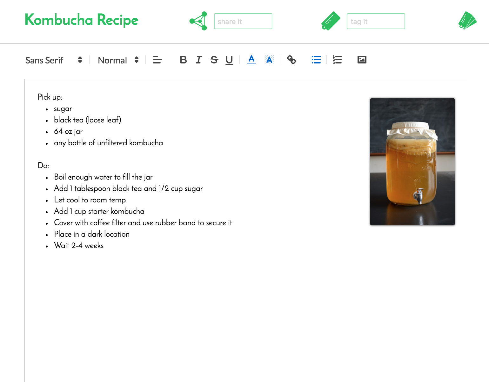
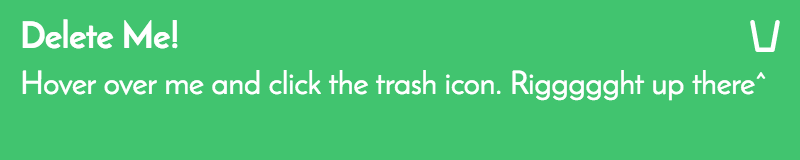
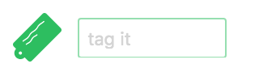

# TogetherNote

TogetherNote is a note taking and organizing app inspired by Evernote. Additionally it allows for multiple users to collaborate on the same note in real time.

[heroku]: http://www.herokuapp.com

## Notes

  

A note has a title, rich text body, and album of images on the right. The body may contain hyperlinks, lists, and other specially formatted text. The album view can be used to store a scrollable list of pictures associated with the note.

Every note is saved immediately upon creation and automatically thereafter. No save button! To create a new note simply click the plus icon next to notebook name on the left.

## Notebooks

Notebooks are the primary way of organizing notes. Every note belongs to a single notebook, and new notebooks can be created in the notebook drawer by clicking the plus icon. Additionally, notes can easily be moved between notebooks simply by dragging the note to its new notebook. Just start dragging a note to see this in action.

## Recycling

Notes can be deleted by hovering over the note's position in the note list and clicking the trash icon. Any note not in the 'Recycling' notebook will move first to this notebook before permanent removal. Any note in the 'Recycling' notebook, though, will be deleted permanently. Don't say I didn't warn you!

Notebooks too can also be deleted, and all their notes will appear in the 'Recycling' notebook as well. The only notebooks that cannot be removed are the 'Inbox' notebook and 'Recycling' notebook itself. In the future I'd like to add a 'delete all' button to easily clean out the recycling notebook when it gets too full.

## Tags and Notebooks

Notes can be tagged with any number of labels for an added layer of organization over notebooks. To tag a note, just enter the tag name in the note's 'tag it' field and hit enter. If the tag does not exist it will be created and added to the note. Otherwise the existing tag will be associated to the note. Your tags can be accessed via the tag drawer in the sidebar, where clicking a tag will display a list of all notes associated with that tag.

## Sharing

The 'share it' field provides a way to grant another user access to a note. Enter the user's username and hit enter. The recipient, if online, will see a notification of the new note which can be clicked to open the note immediately. If the note is not opened immediately, though, they will have access to it in their 'Inbox' notebook. This is the default location for shared notes, but notes can be moved elsewhere without affecting the sender.

## Collaboration

Notes can be edited live by multiple users. Saving occurs periodically for each user, and updates are received live by all online users collaborating on the same note. For now the saving is very simple and overwrites previous versions entirely. I would like to implement a smarter, version-merging system on the back end to avoid lost work.
